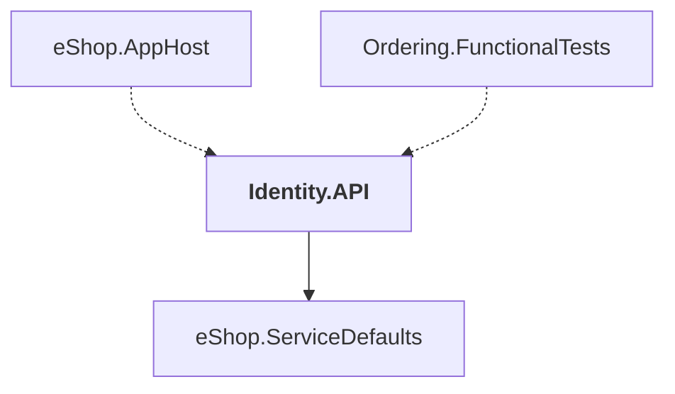

# Identity.API

## Overview

| Property | Value |
|----------|-------|
| Category | WebApp |
| Repository | src |
| Path | `Identity.API/Identity.API.csproj` |
| Project References | 1 |
| NuGet Dependencies | 9 |
| Consumers | 2 |

## Dependency Diagram

## Project References
- eShop.ServiceDefaults

## Consumed By
- eShop.AppHost
- Ordering.FunctionalTests

## External NuGet Packages
| Package | Version |
|---------|---------||
| Duende.IdentityServer.AspNetIdentity |  |
| Duende.IdentityServer.EntityFramework |  |
| Duende.IdentityServer.Storage |  |
| Duende.IdentityServer |  |
| Microsoft.AspNetCore.Identity.EntityFrameworkCore |  |
| Microsoft.AspNetCore.Identity.UI |  |
| Microsoft.EntityFrameworkCore.Tools |  |
| Aspire.Npgsql.EntityFrameworkCore.PostgreSQL |  |
| Microsoft.Web.LibraryManager.Build |  |

## Data Access Patterns
### API.HttpGet
| File | Line | Context |
|------|------|---------||
| `src/Identity.API/Quickstart/Account/ExternalController.cs` | 33 | `[HttpGet]` |
| `src/Identity.API/Quickstart/Account/ExternalController.cs` | 63 | `[HttpGet]` |
| `src/Identity.API/Quickstart/Account/AccountController.cs` | 39 | `[HttpGet]` |
| `src/Identity.API/Quickstart/Account/AccountController.cs` | 146 | `[HttpGet]` |
| `src/Identity.API/Quickstart/Account/AccountController.cs` | 196 | `[HttpGet]` |
| `src/Identity.API/Quickstart/Consent/ConsentController.cs` | 32 | `[HttpGet]` |
| `src/Identity.API/Quickstart/Device/DeviceController.cs` | 27 | `[HttpGet]` |
| `src/Identity.API/Quickstart/Grants/GrantsController.cs` | 32 | `[HttpGet]` |

### API.Controller
| File | Line | Context |
|------|------|---------||
| `src/Identity.API/Quickstart/Account/ExternalController.cs` | 5 | `public class ExternalController : Controller` |
| `src/Identity.API/Quickstart/Account/AccountController.cs` | 8 | `public class AccountController : Controller` |
| `src/Identity.API/Quickstart/Home/HomeController.cs` | 8 | `public class HomeController : Controller` |
| `src/Identity.API/Quickstart/Consent/ConsentController.cs` | 11 | `public class ConsentController : Controller` |
| `src/Identity.API/Quickstart/Device/DeviceController.cs` | 8 | `public class DeviceController : Controller` |
| `src/Identity.API/Quickstart/Grants/GrantsController.cs` | 11 | `public class GrantsController : Controller` |
| `src/Identity.API/Quickstart/Diagnostics/DiagnosticsController.cs` | 9 | `public class DiagnosticsController : Controller` |

### API.HttpPost
| File | Line | Context |
|------|------|---------||
| `src/Identity.API/Quickstart/Account/AccountController.cs` | 59 | `[HttpPost]` |
| `src/Identity.API/Quickstart/Account/AccountController.cs` | 165 | `[HttpPost]` |
| `src/Identity.API/Quickstart/Consent/ConsentController.cs` | 47 | `[HttpPost]` |
| `src/Identity.API/Quickstart/Device/DeviceController.cs` | 41 | `[HttpPost]` |
| `src/Identity.API/Quickstart/Device/DeviceController.cs` | 51 | `[HttpPost]` |
| `src/Identity.API/Quickstart/Grants/GrantsController.cs` | 41 | `[HttpPost]` |

---

*[Back to Index](../../index.md)*
