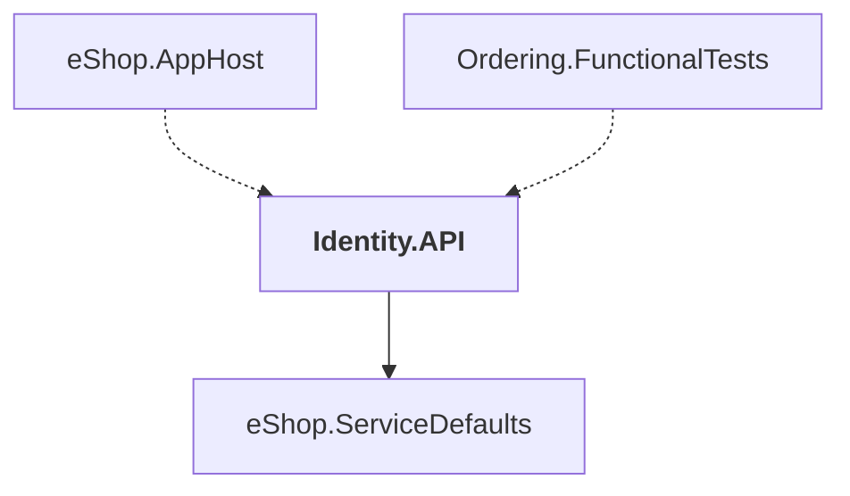

# Identity.API

## Overview

| Property | Value |
|----------|-------|
| Category | WebApp |
| Repository | src |
| Path | `Identity.API/Identity.API.csproj` |
| Project References | 1 |
| NuGet Dependencies | 9 |
| Consumers | 2 |

## Dependency Diagram

## Project References
- eShop.ServiceDefaults

## Consumed By
- eShop.AppHost
- Ordering.FunctionalTests

## External NuGet Packages
| Package | Version |
|---------|---------||
| Duende.IdentityServer.AspNetIdentity |  |
| Duende.IdentityServer.EntityFramework |  |
| Duende.IdentityServer.Storage |  |
| Duende.IdentityServer |  |
| Microsoft.AspNetCore.Identity.EntityFrameworkCore |  |
| Microsoft.AspNetCore.Identity.UI |  |
| Microsoft.EntityFrameworkCore.Tools |  |
| Aspire.Npgsql.EntityFrameworkCore.PostgreSQL |  |
| Microsoft.Web.LibraryManager.Build |  |

---

*[Back to Index](../../index.md)*
