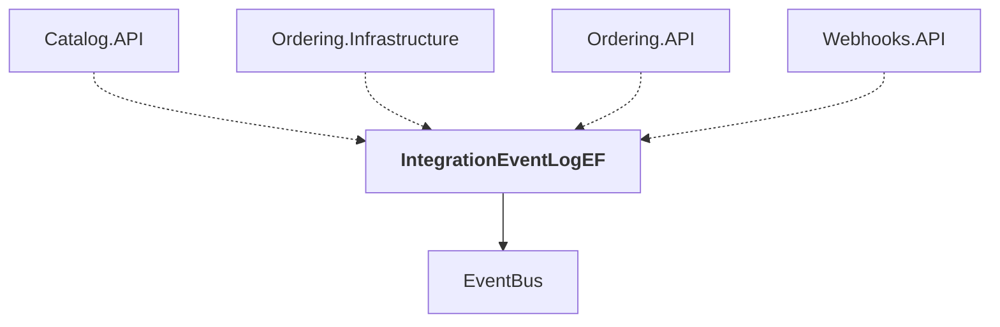

# IntegrationEventLogEF

## Overview

| Property | Value |
|----------|-------|
| Category | Library |
| Repository | src |
| Path | `IntegrationEventLogEF/IntegrationEventLogEF.csproj` |
| Project References | 1 |
| NuGet Dependencies | 1 |
| Consumers | 4 |

## Dependency Diagram

## Project References
- EventBus

## Consumed By
- Catalog.API
- Ordering.Infrastructure
- Ordering.API
- Webhooks.API

## External NuGet Packages
| Package | Version |
|---------|---------||
| Npgsql.EntityFrameworkCore.PostgreSQL |  |

## Data Access Patterns
### DbContext
| File | Line | Context |
|------|------|---------||
| `src/IntegrationEventLogEF/Services/IntegrationEventLogService.cs` | 4 | `where TContext : DbContext` |

---

*[Back to Index](../../index.md)*
