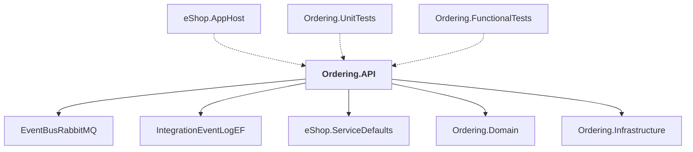

# Ordering.API

## Overview

| Property | Value |
|----------|-------|
| Category | WebApp |
| Repository | src |
| Path | `Ordering.API/Ordering.API.csproj` |
| Project References | 5 |
| NuGet Dependencies | 5 |
| Consumers | 3 |

## Dependency Diagram

## Project References
- EventBusRabbitMQ
- IntegrationEventLogEF
- eShop.ServiceDefaults
- Ordering.Domain
- Ordering.Infrastructure

## Consumed By
- eShop.AppHost
- Ordering.UnitTests
- Ordering.FunctionalTests

## External NuGet Packages
| Package | Version |
|---------|---------||
| Asp.Versioning.Http |  |
| Aspire.Npgsql.EntityFrameworkCore.PostgreSQL |  |
| FluentValidation |  |
| FluentValidation.DependencyInjectionExtensions |  |
| Microsoft.EntityFrameworkCore.Tools |  |

## Data Access Patterns
### Redis.Read
| File | Line | Context |
|------|------|---------||
| `src/Ordering.API/Application/Commands/SetStockConfirmedOrderStatusCommandHandler.cs` | 24 | `var orderToUpdate = await _orderRepository.GetAsync(command.OrderNumbe` |
| `src/Ordering.API/Application/Commands/SetAwaitingValidationOrderStatusCommandHandler.cs` | 21 | `var orderToUpdate = await _orderRepository.GetAsync(command.OrderNumbe` |
| `src/Ordering.API/Application/Commands/CancelOrderCommandHandler.cs` | 21 | `var orderToUpdate = await _orderRepository.GetAsync(command.OrderNumbe` |
| `src/Ordering.API/Application/Commands/SetPaidOrderStatusCommandHandler.cs` | 24 | `var orderToUpdate = await _orderRepository.GetAsync(command.OrderNumbe` |
| `src/Ordering.API/Application/Commands/SetStockRejectedOrderStatusCommandHandler.cs` | 24 | `var orderToUpdate = await _orderRepository.GetAsync(command.OrderNumbe` |
| `src/Ordering.API/Application/Commands/ShipOrderCommandHandler.cs` | 21 | `var orderToUpdate = await _orderRepository.GetAsync(command.OrderNumbe` |
| `src/Ordering.API/Application/DomainEventHandlers/OrderStatusChangedToStockConfirmedDomainEventHandler.cs` | 27 | `var order = await _orderRepository.GetAsync(domainEvent.OrderId);` |
| `src/Ordering.API/Application/DomainEventHandlers/UpdateOrderWhenBuyerAndPaymentMethodVerifiedDomainEventHandler.cs` | 21 | `var orderToUpdate = await _orderRepository.GetAsync(domainEvent.OrderI` |
| `src/Ordering.API/Application/DomainEventHandlers/OrderStatusChangedToAwaitingValidationDomainEventHandler.cs` | 27 | `var order = await _orderRepository.GetAsync(domainEvent.OrderId);` |
| `src/Ordering.API/Application/DomainEventHandlers/OrderStatusChangedToPaidDomainEventHandler.cs` | 26 | `var order = await _orderRepository.GetAsync(domainEvent.OrderId);` |
| `src/Ordering.API/Application/DomainEventHandlers/OrderShippedDomainEventHandler.cs` | 27 | `var order = await _orderRepository.GetAsync(domainEvent.Order.Id);` |
| `src/Ordering.API/Application/DomainEventHandlers/OrderCancelledDomainEventHandler.cs` | 27 | `var order = await _orderRepository.GetAsync(domainEvent.Order.Id);` |

### Dapper.Execute
| File | Line | Context |
|------|------|---------||
| `src/Ordering.API/Application/Behaviors/TransactionBehavior.cs` | 34 | `await strategy.ExecuteAsync(async () =>` |

### MongoDB.Read
| File | Line | Context |
|------|------|---------||
| `src/Ordering.API/Application/DomainEventHandlers/ValidateOrAddBuyerAggregateWhenOrderStartedDomainEventHandler.cs` | 23 | `var buyer = await _buyerRepository.FindAsync(domainEvent.UserId);` |

### EntityFramework
| File | Line | Context |
|------|------|---------||
| `src/Ordering.API/Extensions/Extensions.cs` | 17 | `options.UseNpgsql(builder.Configuration.GetConnectionString("orderingd` |

### ConnectionString
| File | Line | Context |
|------|------|---------||
| `src/Ordering.API/Extensions/Extensions.cs` | 17 | `options.UseNpgsql(builder.Configuration.GetConnectionString("orderingd` |

### API.MapGet
| File | Line | Context |
|------|------|---------||
| `src/Ordering.API/Apis/OrdersApi.cs` | 13 | `api.MapGet("{orderId:int}", GetOrderAsync);` |
| `src/Ordering.API/Apis/OrdersApi.cs` | 14 | `api.MapGet("/", GetOrdersByUserAsync);` |
| `src/Ordering.API/Apis/OrdersApi.cs` | 15 | `api.MapGet("/cardtypes", GetCardTypesAsync);` |

### API.MapPost
| File | Line | Context |
|------|------|---------||
| `src/Ordering.API/Apis/OrdersApi.cs` | 16 | `api.MapPost("/draft", CreateOrderDraftAsync);` |
| `src/Ordering.API/Apis/OrdersApi.cs` | 17 | `api.MapPost("/", CreateOrderAsync);` |

### API.MapPut
| File | Line | Context |
|------|------|---------||
| `src/Ordering.API/Apis/OrdersApi.cs` | 11 | `api.MapPut("/cancel", CancelOrderAsync);` |
| `src/Ordering.API/Apis/OrdersApi.cs` | 12 | `api.MapPut("/ship", ShipOrderAsync);` |

### API.MapGroup
| File | Line | Context |
|------|------|---------||
| `src/Ordering.API/Apis/OrdersApi.cs` | 9 | `var api = app.MapGroup("api/orders").HasApiVersion(1.0);` |

---

*[Back to Index](../../index.md)*
