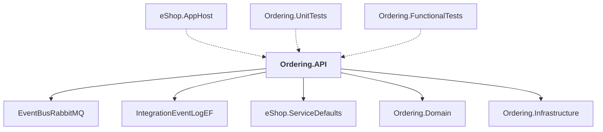

# Ordering.API

## Overview

| Property | Value |
|----------|-------|
| Category | WebApp |
| Repository | src |
| Path | `Ordering.API/Ordering.API.csproj` |
| Project References | 5 |
| NuGet Dependencies | 5 |
| Consumers | 3 |

## Dependency Diagram

## Project References
- EventBusRabbitMQ
- IntegrationEventLogEF
- eShop.ServiceDefaults
- Ordering.Domain
- Ordering.Infrastructure

## Consumed By
- eShop.AppHost
- Ordering.UnitTests
- Ordering.FunctionalTests

## External NuGet Packages
| Package | Version |
|---------|---------||
| Asp.Versioning.Http |  |
| Aspire.Npgsql.EntityFrameworkCore.PostgreSQL |  |
| FluentValidation |  |
| FluentValidation.DependencyInjectionExtensions |  |
| Microsoft.EntityFrameworkCore.Tools |  |

## Data Access Patterns
### ConnectionString
| File | Line | Context |
|------|------|---------||
| `src/Ordering.API/Extensions/Extensions.cs` | 17 | `options.UseNpgsql(builder.Configuration.GetConnectionString("orderingd` |

### EntityFramework
| File | Line | Context |
|------|------|---------||
| `src/Ordering.API/Extensions/Extensions.cs` | 17 | `options.UseNpgsql(builder.Configuration.GetConnectionString("orderingd` |

---

*[Back to Index](../../index.md)*
