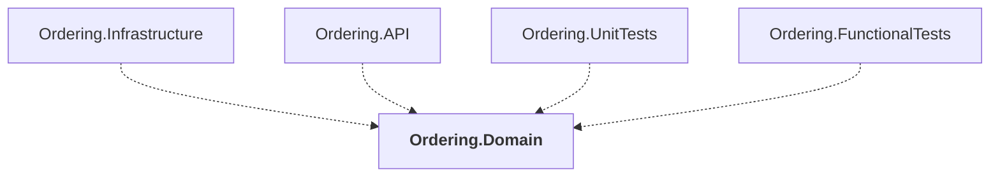

# Ordering.Domain

## Overview

| Property | Value |
|----------|-------|
| Category | Library |
| Repository | src |
| Path | `Ordering.Domain/Ordering.Domain.csproj` |
| Project References | 0 |
| NuGet Dependencies | 2 |
| Consumers | 4 |

## Dependency Diagram

## Consumed By
- Ordering.Infrastructure
- Ordering.API
- Ordering.UnitTests
- Ordering.FunctionalTests

## External NuGet Packages
| Package | Version |
|---------|---------||
| MediatR |  |
| System.Reflection.TypeExtensions |  |

## Data Access Patterns
### MongoDB.Read
| File | Line | Context |
|------|------|---------||
| `src/Ordering.Domain/SeedWork/ValueObject.cs` | 37 | `.Aggregate((x, y) => x ^ y);` |

---

*[Back to Index](../../index.md)*
