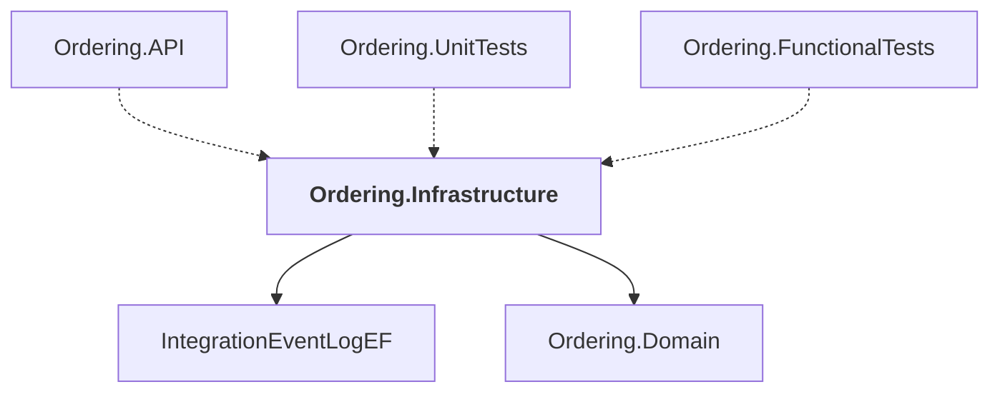

# Ordering.Infrastructure

## Overview

| Property | Value |
|----------|-------|
| Category | Library |
| Repository | src |
| Path | `Ordering.Infrastructure/Ordering.Infrastructure.csproj` |
| Project References | 2 |
| NuGet Dependencies | 1 |
| Consumers | 3 |

## Dependency Diagram

## Project References
- IntegrationEventLogEF
- Ordering.Domain

## Consumed By
- Ordering.API
- Ordering.UnitTests
- Ordering.FunctionalTests

## External NuGet Packages
| Package | Version |
|---------|---------||
| Npgsql.EntityFrameworkCore.PostgreSQL |  |

## Data Access Patterns
### DbContext
| File | Line | Context |
|------|------|---------||
| `src/Ordering.Infrastructure/OrderingContext.cs` | 10 | `public class OrderingContext : DbContext, IUnitOfWork` |

### DbSet
| File | Line | Context |
|------|------|---------||
| `src/Ordering.Infrastructure/OrderingContext.cs` | 12 | `public DbSet<Order> Orders { get; set; }` |
| `src/Ordering.Infrastructure/OrderingContext.cs` | 13 | `public DbSet<OrderItem> OrderItems { get; set; }` |
| `src/Ordering.Infrastructure/OrderingContext.cs` | 14 | `public DbSet<PaymentMethod> Payments { get; set; }` |
| `src/Ordering.Infrastructure/OrderingContext.cs` | 15 | `public DbSet<Buyer> Buyers { get; set; }` |
| `src/Ordering.Infrastructure/OrderingContext.cs` | 16 | `public DbSet<CardType> CardTypes { get; set; }` |

### SQL.Insert
| File | Line | Context |
|------|------|---------||
| `src/Ordering.Infrastructure/Migrations/20240106121712_UseEnumForOrderStatus.cs` | 76 | `INSERT INTO ordering.orderstatus("Id","Name") VALUES` |

### Repository
| File | Line | Context |
|------|------|---------||
| `src/Ordering.Infrastructure/Repositories/BuyerRepository.cs` | 3 | `public class BuyerRepository` |
| `src/Ordering.Infrastructure/Repositories/OrderRepository.cs` | 3 | `public class OrderRepository` |

### MongoDB.Read
| File | Line | Context |
|------|------|---------||
| `src/Ordering.Infrastructure/Repositories/OrderRepository.cs` | 23 | `var order = await _context.Orders.FindAsync(orderId);` |

---

*[Back to Index](../../index.md)*
