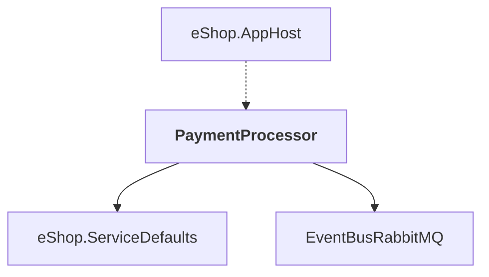

# PaymentProcessor

## Overview

| Property | Value |
|----------|-------|
| Category | WebApp |
| Repository | src |
| Path | `PaymentProcessor/PaymentProcessor.csproj` |
| Project References | 2 |
| NuGet Dependencies | 0 |
| Consumers | 1 |

## Dependency Diagram

## Project References
- eShop.ServiceDefaults
- EventBusRabbitMQ

## Consumed By
- eShop.AppHost

---

*[Back to Index](../../index.md)*
