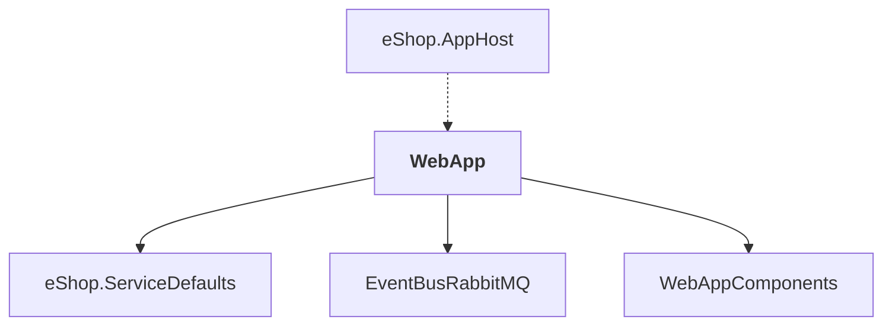

# WebApp

## Overview

| Property | Value |
|----------|-------|
| Category | WebApp |
| Repository | src |
| Path | `WebApp/WebApp.csproj` |
| Project References | 3 |
| NuGet Dependencies | 8 |
| Consumers | 1 |

## Dependency Diagram

## Project References
- eShop.ServiceDefaults
- EventBusRabbitMQ
- WebAppComponents

## Consumed By
- eShop.AppHost

## External NuGet Packages
| Package | Version |
|---------|---------||
| Asp.Versioning.Http.Client |  |
| Aspire.Azure.AI.OpenAI |  |
| CommunityToolkit.Aspire.OllamaSharp |  |
| Microsoft.Extensions.ServiceDiscovery.Yarp |  |
| Microsoft.AspNetCore.Authentication.OpenIdConnect |  |
| Google.Protobuf |  |
| Grpc.Net.ClientFactory |  |
| Grpc.Tools |  |

## Data Access Patterns
### gRPC
| File | Line | Context |
|------|------|---------||
| `src/WebApp/Components/Chatbot/ChatState.cs` | 145 | `catch (Grpc.Core.RpcException e) when (e.StatusCode == Grpc.Core.Statu` |

### HttpClient.Injection
| File | Line | Context |
|------|------|---------||
| `src/WebApp/Extensions/Extensions.cs` | 34 | `builder.Services.AddHttpClient<CatalogService>(o => o.BaseAddress = ne` |
| `src/WebApp/Extensions/Extensions.cs` | 38 | `builder.Services.AddHttpClient<OrderingService>(o => o.BaseAddress = n` |

### ConnectionString
| File | Line | Context |
|------|------|---------||
| `src/WebApp/Extensions/Extensions.cs` | 102 | `else if (!string.IsNullOrWhiteSpace(builder.Configuration.GetConnectio` |

---

*[Back to Index](../../index.md)*
