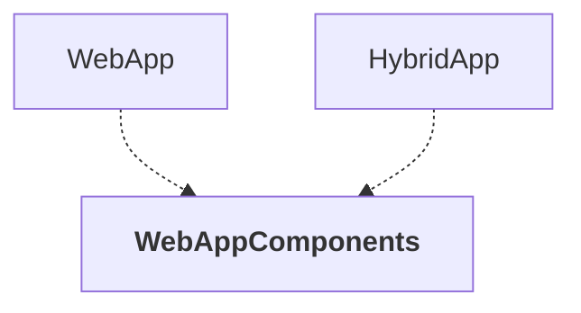

# WebAppComponents

## Overview

| Property | Value |
|----------|-------|
| Category | WebApp |
| Repository | src |
| Path | `WebAppComponents/WebAppComponents.csproj` |
| Project References | 0 |
| NuGet Dependencies | 1 |
| Consumers | 2 |

## Dependency Diagram

## Consumed By
- WebApp
- HybridApp

## External NuGet Packages
| Package | Version |
|---------|---------||
| Microsoft.AspNetCore.Components.Web |  |

---

*[Back to Index](../../index.md)*
