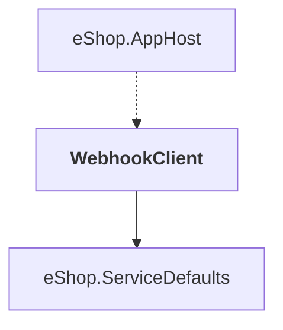

# WebhookClient

## Overview

| Property | Value |
|----------|-------|
| Category | Tool |
| Repository | src |
| Path | `WebhookClient/WebhookClient.csproj` |
| Project References | 1 |
| NuGet Dependencies | 3 |
| Consumers | 1 |

## Dependency Diagram

## Project References
- eShop.ServiceDefaults

## Consumed By
- eShop.AppHost

## External NuGet Packages
| Package | Version |
|---------|---------||
| Asp.Versioning.Http.Client |  |
| Microsoft.AspNetCore.Authentication.OpenIdConnect |  |
| Microsoft.AspNetCore.Components.QuickGrid |  |

## Data Access Patterns
### HttpClient.Injection
| File | Line | Context |
|------|------|---------||
| `src/WebhookClient/Extensions/Extensions.cs` | 19 | `builder.Services.AddHttpClient<WebhooksClient>(o => o.BaseAddress = ne` |

### Repository
| File | Line | Context |
|------|------|---------||
| `src/WebhookClient/Services/HooksRepository.cs` | 5 | `public class HooksRepository` |

---

*[Back to Index](../../index.md)*
