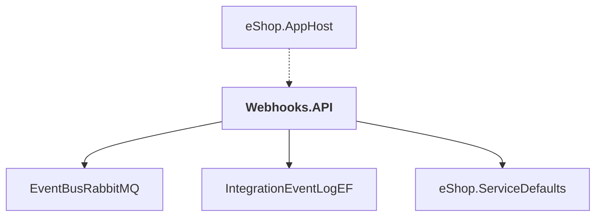

# Webhooks.API

## Overview

| Property | Value |
|----------|-------|
| Category | WebApp |
| Repository | src |
| Path | `Webhooks.API/Webhooks.API.csproj` |
| Project References | 3 |
| NuGet Dependencies | 3 |
| Consumers | 1 |

## Dependency Diagram

## Project References
- EventBusRabbitMQ
- IntegrationEventLogEF
- eShop.ServiceDefaults

## Consumed By
- eShop.AppHost

## External NuGet Packages
| Package | Version |
|---------|---------||
| Asp.Versioning.Http |  |
| Aspire.Npgsql.EntityFrameworkCore.PostgreSQL |  |
| Microsoft.EntityFrameworkCore.Tools |  |

## Data Access Patterns
### DbContext
| File | Line | Context |
|------|------|---------||
| `src/Webhooks.API/Infrastructure/WebhooksContext.cs` | 8 | `public class WebhooksContext(DbContextOptions<WebhooksContext> options` |

---

*[Back to Index](../../index.md)*
