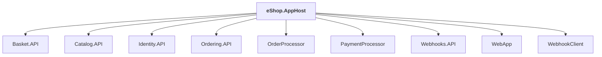

# eShop.AppHost

## Overview

| Property | Value |
|----------|-------|
| Category | Application |
| Repository | src |
| Path | `eShop.AppHost/eShop.AppHost.csproj` |
| Project References | 9 |
| NuGet Dependencies | 6 |
| Consumers | 0 |

## Dependency Diagram

## Project References
- Basket.API
- Catalog.API
- Identity.API
- Ordering.API
- OrderProcessor
- PaymentProcessor
- Webhooks.API
- WebApp
- WebhookClient

## External NuGet Packages
| Package | Version |
|---------|---------||
| Aspire.Hosting.RabbitMQ |  |
| Aspire.Hosting.Redis |  |
| Aspire.Hosting.PostgreSQL |  |
| Aspire.Hosting.Azure.CognitiveServices |  |
| Aspire.Hosting.Yarp |  |
| CommunityToolkit.Aspire.Hosting.Ollama |  |

## Data Access Patterns
### ConnectionString
| File | Line | Context |
|------|------|---------||
| `src/eShop.AppHost/Extensions.cs` | 125 | `var openAIConnectionString = openAIConnectionBuilder.Build();` |
| `src/eShop.AppHost/Extensions.cs` | 127 | `catalogApi.WithReference(builder.AddConnectionString(textEmbeddingName` |
| `src/eShop.AppHost/Extensions.cs` | 129 | `cs.Append($"{openAIConnectionString};Deployment={embeddingModel}");` |
| `src/eShop.AppHost/Extensions.cs` | 131 | `webApp.WithReference(builder.AddConnectionString(chatName, cs =>` |
| `src/eShop.AppHost/Extensions.cs` | 133 | `cs.Append($"{openAIConnectionString};Deployment={chatModel}");` |

---

*[Back to Index](../../index.md)*
