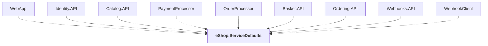

# eShop.ServiceDefaults

## Overview

| Property | Value |
|----------|-------|
| Category | Service |
| Repository | src |
| Path | `eShop.ServiceDefaults/eShop.ServiceDefaults.csproj` |
| Project References | 0 |
| NuGet Dependencies | 13 |
| Consumers | 9 |

## Dependency Diagram

## Consumed By
- WebApp
- Identity.API
- Catalog.API
- PaymentProcessor
- OrderProcessor
- Basket.API
- Ordering.API
- Webhooks.API
- WebhookClient

## External NuGet Packages
| Package | Version |
|---------|---------||
| Asp.Versioning.Mvc.ApiExplorer |  |
| Microsoft.AspNetCore.OpenApi |  |
| Microsoft.OpenApi |  |
| Scalar.AspNetCore |  |
| Microsoft.AspNetCore.Authentication.JwtBearer |  |
| Microsoft.Extensions.Http.Resilience |  |
| Microsoft.Extensions.ServiceDiscovery |  |
| OpenTelemetry.Exporter.OpenTelemetryProtocol |  |
| OpenTelemetry.Extensions.Hosting |  |
| OpenTelemetry.Instrumentation.AspNetCore |  |
| OpenTelemetry.Instrumentation.GrpcNetClient |  |
| OpenTelemetry.Instrumentation.Http |  |
| OpenTelemetry.Instrumentation.Runtime |  |

## Data Access Patterns
### API.MapGet
| File | Line | Context |
|------|------|---------||
| `src/eShop.ServiceDefaults/OpenApi.Extensions.cs` | 33 | `app.MapGet("/", () => Results.Redirect("/scalar/v1")).ExcludeFromDescr` |

---

*[Back to Index](../../index.md)*
