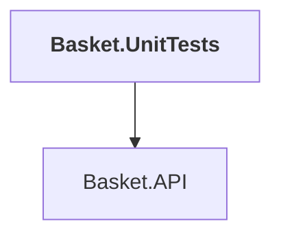

# Basket.UnitTests

## Overview

| Property | Value |
|----------|-------|
| Category | Test |
| Repository | tests |
| Path | `Basket.UnitTests/Basket.UnitTests.csproj` |
| Project References | 1 |
| NuGet Dependencies | 4 |
| Consumers | 0 |

## Dependency Diagram

## Project References
- Basket.API

## External NuGet Packages
| Package | Version |
|---------|---------||
| Microsoft.AspNetCore.Mvc.Testing |  |
| Microsoft.Extensions.Identity.Stores |  |
| NSubstitute |  |
| NSubstitute.Analyzers.CSharp |  |

## Data Access Patterns
### gRPC.Server
| File | Line | Context |
|------|------|---------||
| `tests/Basket.UnitTests/BasketServiceTests.cs` | 21 | `var serverCallContext = TestServerCallContext.Create(cancellationToken` |
| `tests/Basket.UnitTests/BasketServiceTests.cs` | 37 | `var serverCallContext = TestServerCallContext.Create(cancellationToken` |
| `tests/Basket.UnitTests/BasketServiceTests.cs` | 55 | `var serverCallContext = TestServerCallContext.Create(cancellationToken` |
| `tests/Basket.UnitTests/Helpers/TestServerCallContext.cs` | 5 | `public class TestServerCallContext : ServerCallContext` |
| `tests/Basket.UnitTests/Helpers/TestServerCallContext.cs` | 16 | `private TestServerCallContext(Metadata requestHeaders, CancellationTok` |
| `tests/Basket.UnitTests/Helpers/TestServerCallContext.cs` | 57 | `public static TestServerCallContext Create(Metadata requestHeaders = n` |
| `tests/Basket.UnitTests/Helpers/TestServerCallContext.cs` | 59 | `return new TestServerCallContext(requestHeaders: new Metadata(), cance` |

### gRPC
| File | Line | Context |
|------|------|---------||
| `tests/Basket.UnitTests/Helpers/TestServerCallContext.cs` | 1 | `using Grpc.Core;` |

---

*[Back to Index](../../index.md)*
