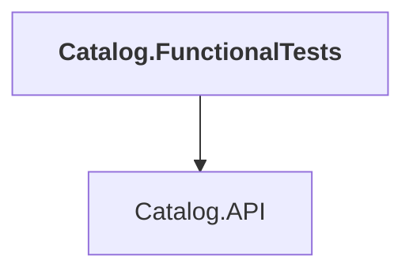

# Catalog.FunctionalTests

## Overview

| Property | Value |
|----------|-------|
| Category | Test |
| Repository | tests |
| Path | `Catalog.FunctionalTests/Catalog.FunctionalTests.csproj` |
| Project References | 1 |
| NuGet Dependencies | 5 |
| Consumers | 0 |

## Dependency Diagram

## Project References
- Catalog.API

## External NuGet Packages
| Package | Version |
|---------|---------||
| Asp.Versioning.Http.Client |  |
| Aspire.Hosting.PostgreSQL |  |
| Microsoft.AspNetCore.Mvc.Testing |  |
| Microsoft.AspNetCore.TestHost |  |
| xunit.v3.mtp-v2 |  |

## Data Access Patterns
### ConnectionString
| File | Line | Context |
|------|------|---------||
| `tests/Catalog.FunctionalTests/CatalogApiFixture.cs` | 15 | `private string _postgresConnectionString;` |
| `tests/Catalog.FunctionalTests/CatalogApiFixture.cs` | 33 | `{ $"ConnectionStrings:{Postgres.Resource.Name}", _postgresConnectionSt` |
| `tests/Catalog.FunctionalTests/CatalogApiFixture.cs` | 56 | `_postgresConnectionString = await Postgres.Resource.GetConnectionStrin` |

### HttpClient.GetAsync
| File | Line | Context |
|------|------|---------||
| `tests/Catalog.FunctionalTests/CatalogApiTests.cs` | 34 | `var response = await _httpClient.GetAsync("/api/catalog/items?pageInde` |
| `tests/Catalog.FunctionalTests/CatalogApiTests.cs` | 55 | `var response = await _httpClient.GetAsync("/api/catalog/items/1", Test` |
| `tests/Catalog.FunctionalTests/CatalogApiTests.cs` | 72 | `response = await _httpClient.GetAsync("/api/catalog/items/1", TestCont` |
| `tests/Catalog.FunctionalTests/CatalogApiTests.cs` | 90 | `var response = await _httpClient.GetAsync("/api/catalog/items/1", Test` |
| `tests/Catalog.FunctionalTests/CatalogApiTests.cs` | 108 | `response = await _httpClient.GetAsync("/api/catalog/items/1", TestCont` |
| `tests/Catalog.FunctionalTests/CatalogApiTests.cs` | 127 | `var response = await _httpClient.GetAsync("/api/catalog/items/by?ids=1` |
| `tests/Catalog.FunctionalTests/CatalogApiTests.cs` | 146 | `var response = await _httpClient.GetAsync("/api/catalog/items/2", Test` |
| `tests/Catalog.FunctionalTests/CatalogApiTests.cs` | 168 | `1.0 => await _httpClient.GetAsync("api/catalog/items/by/Wanderer%20Bla` |
| `tests/Catalog.FunctionalTests/CatalogApiTests.cs` | 169 | `2.0 => await _httpClient.GetAsync("api/catalog/items?name=Wanderer%20B` |
| `tests/Catalog.FunctionalTests/CatalogApiTests.cs` | 196 | `1.0 => await _httpClient.GetAsync("api/catalog/items/by/Alpine?PageSiz` |
| `tests/Catalog.FunctionalTests/CatalogApiTests.cs` | 197 | `2.0 => await _httpClient.GetAsync("api/catalog/items?name=Alpine&PageS` |
| `tests/Catalog.FunctionalTests/CatalogApiTests.cs` | 222 | `var response = await _httpClient.GetAsync("api/catalog/items/1/pic", T` |
| `tests/Catalog.FunctionalTests/CatalogApiTests.cs` | 242 | `1.0 => await _httpClient.GetAsync("api/catalog/items/withsemanticrelev` |
| `tests/Catalog.FunctionalTests/CatalogApiTests.cs` | 243 | `2.0 => await _httpClient.GetAsync("api/catalog/items/withsemanticrelev` |
| `tests/Catalog.FunctionalTests/CatalogApiTests.cs` | 269 | `1.0 => await _httpClient.GetAsync("api/catalog/items/type/3/brand/3?Pa` |

*... and 5 more*

### HttpClient.PostAsync
| File | Line | Context |
|------|------|---------||
| `tests/Catalog.FunctionalTests/CatalogApiTests.cs` | 384 | `var response = await _httpClient.PostAsJsonAsync("/api/catalog/items",` |

### HttpClient.PutAsync
| File | Line | Context |
|------|------|---------||
| `tests/Catalog.FunctionalTests/CatalogApiTests.cs` | 65 | `1.0 => await _httpClient.PutAsJsonAsync("/api/catalog/items", itemToUp` |
| `tests/Catalog.FunctionalTests/CatalogApiTests.cs` | 101 | `1.0 => await _httpClient.PutAsJsonAsync("/api/catalog/items", itemToUp` |

### Redis.Read
| File | Line | Context |
|------|------|---------||
| `tests/Catalog.FunctionalTests/CatalogApiTests.cs` | 34 | `var response = await _httpClient.GetAsync("/api/catalog/items?pageInde` |
| `tests/Catalog.FunctionalTests/CatalogApiTests.cs` | 55 | `var response = await _httpClient.GetAsync("/api/catalog/items/1", Test` |
| `tests/Catalog.FunctionalTests/CatalogApiTests.cs` | 72 | `response = await _httpClient.GetAsync("/api/catalog/items/1", TestCont` |
| `tests/Catalog.FunctionalTests/CatalogApiTests.cs` | 90 | `var response = await _httpClient.GetAsync("/api/catalog/items/1", Test` |
| `tests/Catalog.FunctionalTests/CatalogApiTests.cs` | 108 | `response = await _httpClient.GetAsync("/api/catalog/items/1", TestCont` |
| `tests/Catalog.FunctionalTests/CatalogApiTests.cs` | 127 | `var response = await _httpClient.GetAsync("/api/catalog/items/by?ids=1` |
| `tests/Catalog.FunctionalTests/CatalogApiTests.cs` | 146 | `var response = await _httpClient.GetAsync("/api/catalog/items/2", Test` |
| `tests/Catalog.FunctionalTests/CatalogApiTests.cs` | 168 | `1.0 => await _httpClient.GetAsync("api/catalog/items/by/Wanderer%20Bla` |
| `tests/Catalog.FunctionalTests/CatalogApiTests.cs` | 169 | `2.0 => await _httpClient.GetAsync("api/catalog/items?name=Wanderer%20B` |
| `tests/Catalog.FunctionalTests/CatalogApiTests.cs` | 196 | `1.0 => await _httpClient.GetAsync("api/catalog/items/by/Alpine?PageSiz` |
| `tests/Catalog.FunctionalTests/CatalogApiTests.cs` | 197 | `2.0 => await _httpClient.GetAsync("api/catalog/items?name=Alpine&PageS` |
| `tests/Catalog.FunctionalTests/CatalogApiTests.cs` | 222 | `var response = await _httpClient.GetAsync("api/catalog/items/1/pic", T` |
| `tests/Catalog.FunctionalTests/CatalogApiTests.cs` | 242 | `1.0 => await _httpClient.GetAsync("api/catalog/items/withsemanticrelev` |
| `tests/Catalog.FunctionalTests/CatalogApiTests.cs` | 243 | `2.0 => await _httpClient.GetAsync("api/catalog/items/withsemanticrelev` |
| `tests/Catalog.FunctionalTests/CatalogApiTests.cs` | 269 | `1.0 => await _httpClient.GetAsync("api/catalog/items/type/3/brand/3?Pa` |

*... and 7 more*

---

*[Back to Index](../../index.md)*
