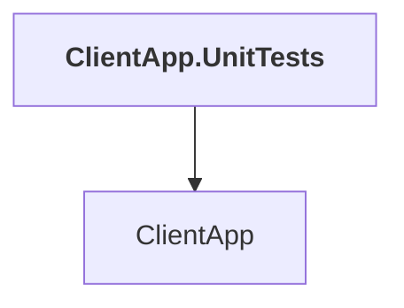

# ClientApp.UnitTests

## Overview

| Property | Value |
|----------|-------|
| Category | Test |
| Repository | tests |
| Path | `ClientApp.UnitTests/ClientApp.UnitTests.csproj` |
| Project References | 1 |
| NuGet Dependencies | 3 |
| Consumers | 0 |

## Dependency Diagram

## Project References
- ClientApp

## External NuGet Packages
| Package | Version |
|---------|---------||
| Microsoft.Maui.Controls | 9.0.40 |
| Microsoft.Maui.Controls.Compatibility | 9.0.40 |
| Microsoft.Maui.Controls.Maps | 9.0.40 |

## Data Access Patterns
### Dapper
| File | Line | Context |
|------|------|---------||
| `tests/ClientApp.UnitTests/TestingExtensions.cs` | 16 | `command.Execute(parameter);` |

---

*[Back to Index](../../index.md)*
