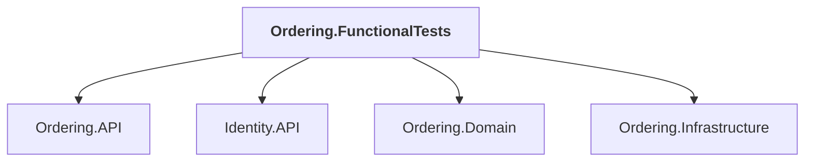

# Ordering.FunctionalTests

## Overview

| Property | Value |
|----------|-------|
| Category | Test |
| Repository | tests |
| Path | `Ordering.FunctionalTests/Ordering.FunctionalTests.csproj` |
| Project References | 4 |
| NuGet Dependencies | 5 |
| Consumers | 0 |

## Dependency Diagram

## Project References
- Ordering.API
- Identity.API
- Ordering.Domain
- Ordering.Infrastructure

## External NuGet Packages
| Package | Version |
|---------|---------||
| Asp.Versioning.Http.Client |  |
| Aspire.Hosting.PostgreSQL |  |
| Microsoft.AspNetCore.Mvc.Testing |  |
| Microsoft.AspNetCore.TestHost |  |
| xunit.v3.mtp-v2 |  |

## Data Access Patterns
### ConnectionString
| File | Line | Context |
|------|------|---------||
| `tests/Ordering.FunctionalTests/OrderingApiFixture.cs` | 17 | `private string _postgresConnectionString;` |
| `tests/Ordering.FunctionalTests/OrderingApiFixture.cs` | 35 | `{ $"ConnectionStrings:{Postgres.Resource.Name}", _postgresConnectionSt` |
| `tests/Ordering.FunctionalTests/OrderingApiFixture.cs` | 63 | `_postgresConnectionString = await Postgres.Resource.GetConnectionStrin` |

---

*[Back to Index](../../index.md)*
