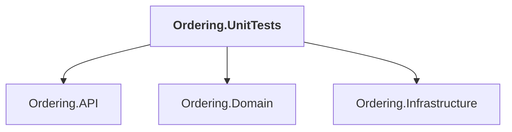

# Ordering.UnitTests

## Overview

| Property | Value |
|----------|-------|
| Category | Test |
| Repository | tests |
| Path | `Ordering.UnitTests/Ordering.UnitTests.csproj` |
| Project References | 3 |
| NuGet Dependencies | 2 |
| Consumers | 0 |

## Dependency Diagram

## Project References
- Ordering.API
- Ordering.Domain
- Ordering.Infrastructure

## External NuGet Packages
| Package | Version |
|---------|---------||
| NSubstitute |  |
| NSubstitute.Analyzers.CSharp |  |

---

*[Back to Index](../../index.md)*
