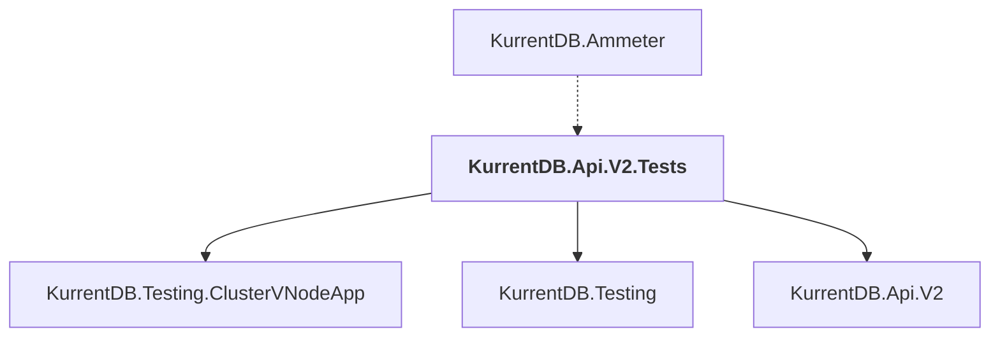

# KurrentDB.Api.V2.Tests

## Overview

| Property | Value |
|----------|-------|
| Category | Test |
| Repository | src |
| Path | `KurrentDB.Api.V2.Tests/KurrentDB.Api.V2.Tests.csproj` |
| Project References | 3 |
| NuGet Dependencies | 4 |
| Consumers | 1 |

## Dependency Diagram

## Project References
- KurrentDB.Testing.ClusterVNodeApp
- KurrentDB.Testing
- KurrentDB.Api.V2

## Consumed By
- KurrentDB.Ammeter

## External NuGet Packages
| Package | Version |
|---------|---------||
| Grpc.Net.Client |  |
| Grpc.StatusProto |  |
| Microsoft.Extensions.Diagnostics.Testing |  |
| System.Linq.Async |  |

---

*[Back to Index](../index.md)*
