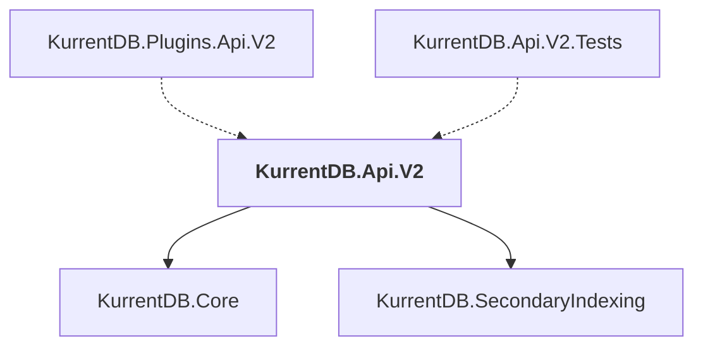

# KurrentDB.Api.V2

## Overview

| Property | Value |
|----------|-------|
| Category | WebApp |
| Repository | src |
| Path | `KurrentDB.Api.V2/KurrentDB.Api.V2.csproj` |
| Project References | 2 |
| NuGet Dependencies | 10 |
| Consumers | 2 |

## Dependency Diagram

## Project References
- KurrentDB.Core
- KurrentDB.SecondaryIndexing

## Consumed By
- KurrentDB.Plugins.Api.V2
- KurrentDB.Api.V2.Tests

## External NuGet Packages
| Package | Version |
|---------|---------||
| FluentValidation.DependencyInjectionExtensions |  |
| Google.Protobuf |  |
| Grpc.AspNetCore |  |
| Grpc.AspNetCore.Web |  |
| Grpc.Tools |  |
| Grpc.StatusProto |  |
| Humanizer.Core |  |
| Microsoft.AspNetCore.Grpc.JsonTranscoding |  |
| Scrutor |  |
| System.Linq.Async |  |

---

*[Back to Index](../index.md)*
