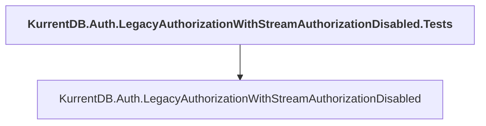

# KurrentDB.Auth.LegacyAuthorizationWithStreamAuthorizationDisabled.Tests

## Overview

| Property | Value |
|----------|-------|
| Category | Test |
| Repository | src |
| Path | `KurrentDB.Auth.LegacyAuthorizationWithStreamAuthorizationDisabled.Tests/KurrentDB.Auth.LegacyAuthorizationWithStreamAuthorizationDisabled.Tests.csproj` |
| Project References | 1 |
| NuGet Dependencies | 4 |
| Consumers | 0 |

## Dependency Diagram

## Project References
- KurrentDB.Auth.LegacyAuthorizationWithStreamAuthorizationDisabled

## External NuGet Packages
| Package | Version |
|---------|---------||
| Ductus.FluentDocker.XUnit |  |
| EventStore.Client.Grpc.Streams |  |
| Microsoft.AspNetCore.TestHost |  |
| Polly |  |

---

*[Back to Index](../index.md)*
