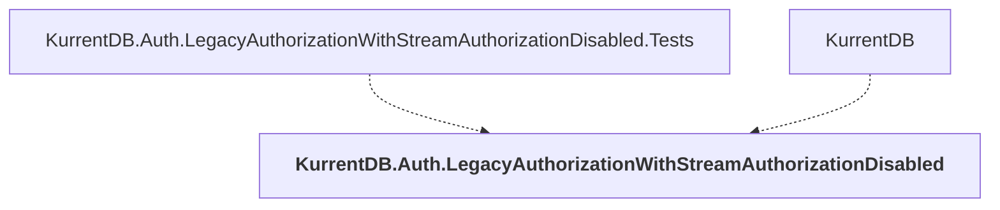

# KurrentDB.Auth.LegacyAuthorizationWithStreamAuthorizationDisabled

## Overview

| Property | Value |
|----------|-------|
| Category | Application |
| Repository | src |
| Path | `KurrentDB.Auth.LegacyAuthorizationWithStreamAuthorizationDisabled/KurrentDB.Auth.LegacyAuthorizationWithStreamAuthorizationDisabled.csproj` |
| Project References | 0 |
| NuGet Dependencies | 2 |
| Consumers | 2 |

## Dependency Diagram

## Consumed By
- KurrentDB.Auth.LegacyAuthorizationWithStreamAuthorizationDisabled.Tests
- KurrentDB

## External NuGet Packages
| Package | Version |
|---------|---------||
| System.ComponentModel.Composition |  |
| Serilog |  |

---

*[Back to Index](../index.md)*
