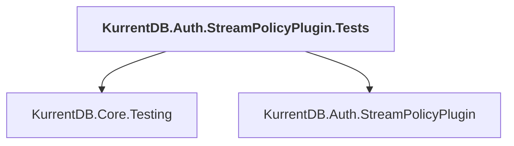

# KurrentDB.Auth.StreamPolicyPlugin.Tests

## Overview

| Property | Value |
|----------|-------|
| Category | Test |
| Repository | src |
| Path | `KurrentDB.Auth.StreamPolicyPlugin.Tests/KurrentDB.Auth.StreamPolicyPlugin.Tests.csproj` |
| Project References | 2 |
| NuGet Dependencies | 0 |
| Consumers | 0 |

## Dependency Diagram

## Project References
- KurrentDB.Core.Testing
- KurrentDB.Auth.StreamPolicyPlugin

---

*[Back to Index](../index.md)*
