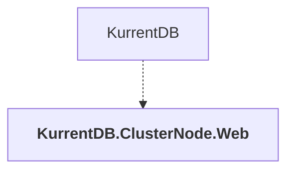

# KurrentDB.ClusterNode.Web

## Overview

| Property | Value |
|----------|-------|
| Category | WebApp |
| Repository | src |
| Path | `KurrentDB.ClusterNode.Web/KurrentDB.ClusterNode.Web.csproj` |
| Project References | 0 |
| NuGet Dependencies | 0 |
| Consumers | 1 |

## Dependency Diagram

## Consumed By
- KurrentDB

---

*[Back to Index](../index.md)*
