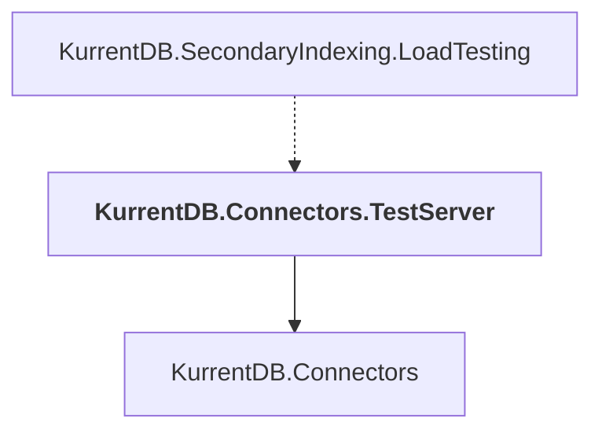

# KurrentDB.Connectors.TestServer

## Overview

| Property | Value |
|----------|-------|
| Category | Test |
| Repository | src |
| Path | `Connectors/KurrentDB.Connectors.TestServer/KurrentDB.Connectors.TestServer.csproj` |
| Project References | 1 |
| NuGet Dependencies | 0 |
| Consumers | 1 |

## Dependency Diagram

## Project References
- KurrentDB.Connectors

## Consumed By
- KurrentDB.SecondaryIndexing.LoadTesting

---

*[Back to Index](../index.md)*
