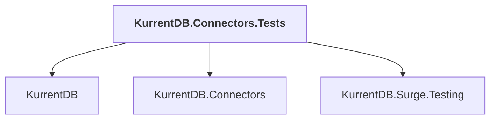

# KurrentDB.Connectors.Tests

## Overview

| Property | Value |
|----------|-------|
| Category | Test |
| Repository | src |
| Path | `Connectors/KurrentDB.Connectors.Tests/KurrentDB.Connectors.Tests.csproj` |
| Project References | 3 |
| NuGet Dependencies | 2 |
| Consumers | 0 |

## Dependency Diagram

## Project References
- KurrentDB
- KurrentDB.Connectors
- KurrentDB.Surge.Testing

## External NuGet Packages
| Package | Version |
|---------|---------||
| Kurrent.Surge |  |
| Eventuous.Testing |  |

---

*[Back to Index](../index.md)*
