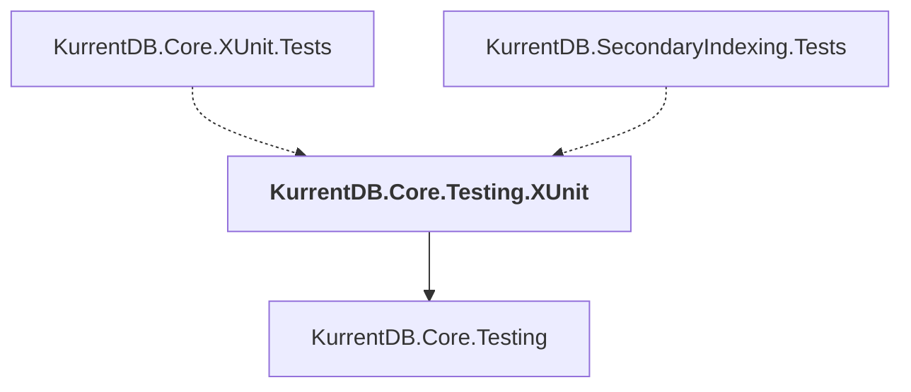

# KurrentDB.Core.Testing.XUnit

## Overview

| Property | Value |
|----------|-------|
| Category | Test |
| Repository | src |
| Path | `KurrentDB.Core.Testing.XUnit/KurrentDB.Core.Testing.XUnit.csproj` |
| Project References | 1 |
| NuGet Dependencies | 1 |
| Consumers | 2 |

## Dependency Diagram

## Project References
- KurrentDB.Core.Testing

## Consumed By
- KurrentDB.Core.XUnit.Tests
- KurrentDB.SecondaryIndexing.Tests

## External NuGet Packages
| Package | Version |
|---------|---------||
| xunit.v3.extensibility.core |  |

---

*[Back to Index](../index.md)*
