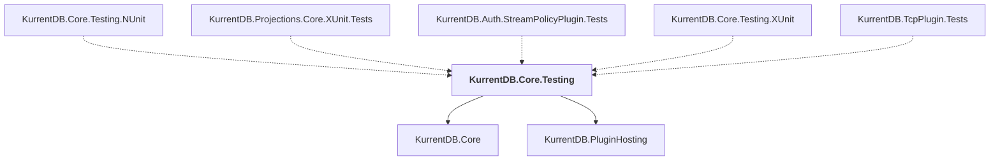

# KurrentDB.Core.Testing

## Overview

| Property | Value |
|----------|-------|
| Category | Test |
| Repository | src |
| Path | `KurrentDB.Core.Testing/KurrentDB.Core.Testing.csproj` |
| Project References | 2 |
| NuGet Dependencies | 6 |
| Consumers | 5 |

## Dependency Diagram

## Project References
- KurrentDB.Core
- KurrentDB.PluginHosting

## Consumed By
- KurrentDB.Core.Testing.NUnit
- KurrentDB.Projections.Core.XUnit.Tests
- KurrentDB.Auth.StreamPolicyPlugin.Tests
- KurrentDB.Core.Testing.XUnit
- KurrentDB.TcpPlugin.Tests

## External NuGet Packages
| Package | Version |
|---------|---------||
| EventStore.Client |  |
| FluentAssertions |  |
| Microsoft.AspNetCore.TestHost |  |
| Serilog.Sinks.InMemory |  |
| Serilog.AspNetCore |  |
| IgnoresAccessChecksToGenerator |  |

---

*[Back to Index](../index.md)*
