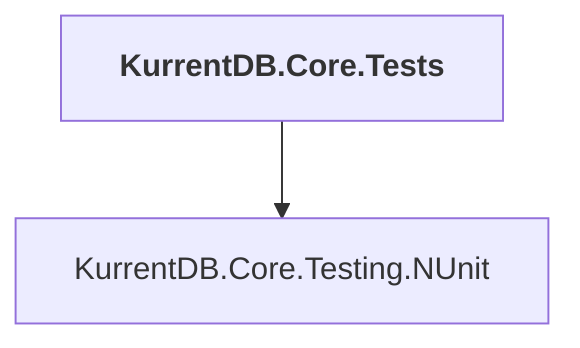

# KurrentDB.Core.Tests

## Overview

| Property | Value |
|----------|-------|
| Category | Test |
| Repository | src |
| Path | `KurrentDB.Core.Tests/KurrentDB.Core.Tests.csproj` |
| Project References | 1 |
| NuGet Dependencies | 3 |
| Consumers | 0 |

## Dependency Diagram

## Project References
- KurrentDB.Core.Testing.NUnit

## External NuGet Packages
| Package | Version |
|---------|---------||
| Microsoft.OpenApi.Readers |  |
| System.Linq.Async |  |
| IgnoresAccessChecksToGenerator |  |

---

*[Back to Index](../index.md)*
