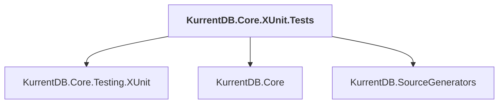

# KurrentDB.Core.XUnit.Tests

## Overview

| Property | Value |
|----------|-------|
| Category | Test |
| Repository | src |
| Path | `KurrentDB.Core.XUnit.Tests/KurrentDB.Core.XUnit.Tests.csproj` |
| Project References | 3 |
| NuGet Dependencies | 4 |
| Consumers | 0 |

## Dependency Diagram

## Project References
- KurrentDB.Core.Testing.XUnit
- KurrentDB.Core
- KurrentDB.SourceGenerators

## External NuGet Packages
| Package | Version |
|---------|---------||
| TestableIO.System.IO.Abstractions |  |
| TestableIO.System.IO.Abstractions.TestingHelpers |  |
| Microsoft.Extensions.Diagnostics.Testing |  |
| System.Linq.Async |  |

---

*[Back to Index](../index.md)*
