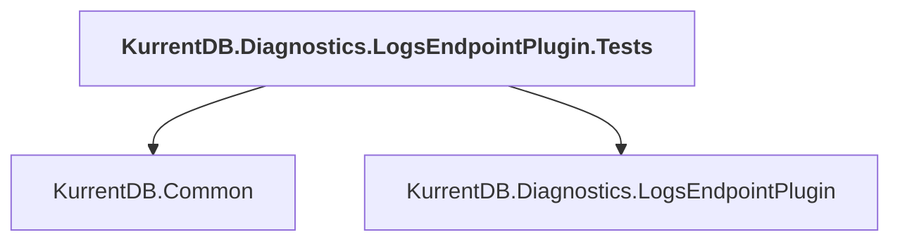

# KurrentDB.Diagnostics.LogsEndpointPlugin.Tests

## Overview

| Property | Value |
|----------|-------|
| Category | Test |
| Repository | src |
| Path | `KurrentDB.Diagnostics.LogsEndpointPlugin.Tests/KurrentDB.Diagnostics.LogsEndpointPlugin.Tests.csproj` |
| Project References | 2 |
| NuGet Dependencies | 1 |
| Consumers | 0 |

## Dependency Diagram

## Project References
- KurrentDB.Common
- KurrentDB.Diagnostics.LogsEndpointPlugin

## External NuGet Packages
| Package | Version |
|---------|---------||
| FluentAssertions |  |

---

*[Back to Index](../index.md)*
