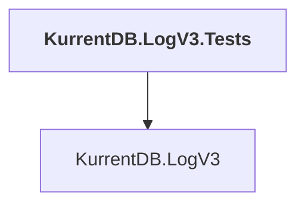

# KurrentDB.LogV3.Tests

## Overview

| Property | Value |
|----------|-------|
| Category | Test |
| Repository | src |
| Path | `KurrentDB.LogV3.Tests/KurrentDB.LogV3.Tests.csproj` |
| Project References | 1 |
| NuGet Dependencies | 2 |
| Consumers | 0 |

## Dependency Diagram

## Project References
- KurrentDB.LogV3

## External NuGet Packages
| Package | Version |
|---------|---------||
| Newtonsoft.Json |  |
| ObjectLayoutInspector |  |

---

*[Back to Index](../index.md)*
