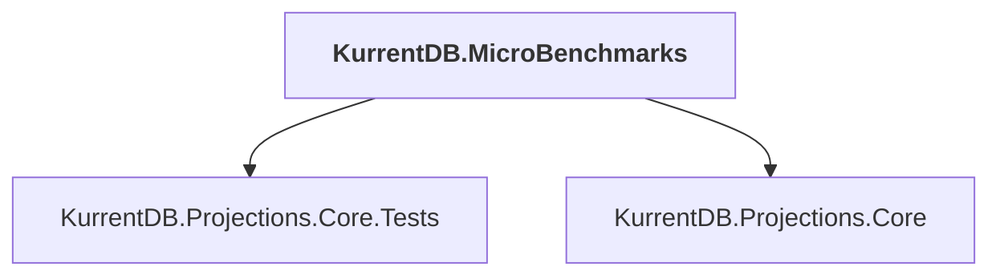

# KurrentDB.MicroBenchmarks

## Overview

| Property | Value |
|----------|-------|
| Category | Application |
| Repository | src |
| Path | `KurrentDB.MicroBenchmarks/KurrentDB.MicroBenchmarks.csproj` |
| Project References | 2 |
| NuGet Dependencies | 1 |
| Consumers | 0 |

## Dependency Diagram

## Project References
- KurrentDB.Projections.Core.Tests
- KurrentDB.Projections.Core

## External NuGet Packages
| Package | Version |
|---------|---------||
| BenchmarkDotNet |  |

---

*[Back to Index](../index.md)*
