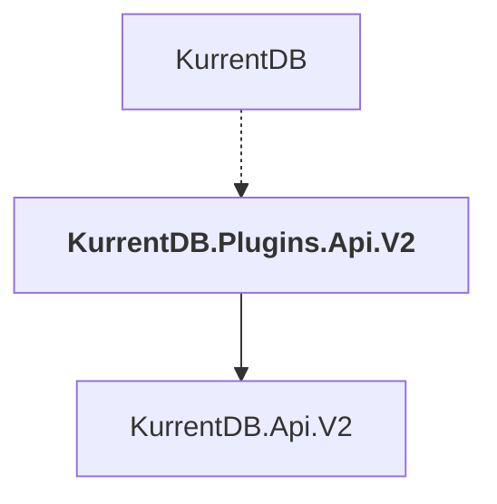

# KurrentDB.Plugins.Api.V2

## Overview

| Property | Value |
|----------|-------|
| Category | WebApp |
| Repository | src |
| Path | `KurrentDB.Plugins.Api.V2/KurrentDB.Plugins.Api.V2.csproj` |
| Project References | 1 |
| NuGet Dependencies | 0 |
| Consumers | 1 |

## Dependency Diagram

## Project References
- KurrentDB.Api.V2

## Consumed By
- KurrentDB

---

*[Back to Index](../index.md)*
