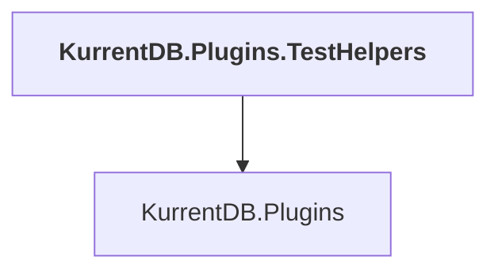

# KurrentDB.Plugins.TestHelpers

## Overview

| Property | Value |
|----------|-------|
| Category | Test |
| Repository | src |
| Path | `KurrentDB.Plugins.TestHelpers/KurrentDB.Plugins.TestHelpers.csproj` |
| Project References | 1 |
| NuGet Dependencies | 0 |
| Consumers | 0 |

## Dependency Diagram

## Project References
- KurrentDB.Plugins

---

*[Back to Index](../index.md)*
