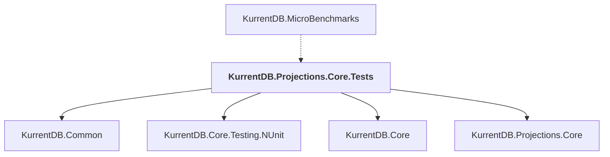

# KurrentDB.Projections.Core.Tests

## Overview

| Property | Value |
|----------|-------|
| Category | Test |
| Repository | src |
| Path | `KurrentDB.Projections.Core.Tests/KurrentDB.Projections.Core.Tests.csproj` |
| Project References | 4 |
| NuGet Dependencies | 4 |
| Consumers | 1 |

## Dependency Diagram

## Project References
- KurrentDB.Common
- KurrentDB.Core.Testing.NUnit
- KurrentDB.Core
- KurrentDB.Projections.Core

## Consumed By
- KurrentDB.MicroBenchmarks

## External NuGet Packages
| Package | Version |
|---------|---------||
| Newtonsoft.Json |  |
| Serilog.Sinks.TextWriter |  |
| Google.Protobuf |  |
| Grpc.Tools |  |

---

*[Back to Index](../index.md)*
