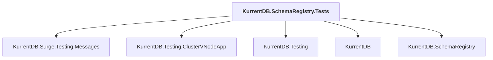

# KurrentDB.SchemaRegistry.Tests

## Overview

| Property | Value |
|----------|-------|
| Category | Test |
| Repository | src |
| Path | `SchemaRegistry/KurrentDB.SchemaRegistry.Tests/KurrentDB.SchemaRegistry.Tests.csproj` |
| Project References | 5 |
| NuGet Dependencies | 3 |
| Consumers | 0 |

## Dependency Diagram

## Project References
- KurrentDB.Surge.Testing.Messages
- KurrentDB.Testing.ClusterVNodeApp
- KurrentDB.Testing
- KurrentDB
- KurrentDB.SchemaRegistry

## External NuGet Packages
| Package | Version |
|---------|---------||
| Kurrent.Surge |  |
| Kurrent.Surge.DuckDB |  |
| Shouldly |  |

---

*[Back to Index](../index.md)*
