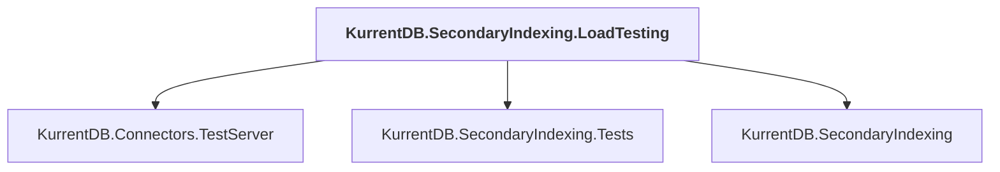

# KurrentDB.SecondaryIndexing.LoadTesting

## Overview

| Property | Value |
|----------|-------|
| Category | Test |
| Repository | src |
| Path | `KurrentDB.SecondaryIndexing.LoadTesting/KurrentDB.SecondaryIndexing.LoadTesting.csproj` |
| Project References | 3 |
| NuGet Dependencies | 2 |
| Consumers | 0 |

## Dependency Diagram

## Project References
- KurrentDB.Connectors.TestServer
- KurrentDB.SecondaryIndexing.Tests
- KurrentDB.SecondaryIndexing

## External NuGet Packages
| Package | Version |
|---------|---------||
| Dapper |  |
| KurrentDB.Client |  |

---

*[Back to Index](../index.md)*
