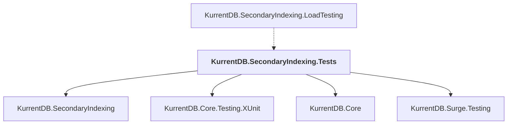

# KurrentDB.SecondaryIndexing.Tests

## Overview

| Property | Value |
|----------|-------|
| Category | Test |
| Repository | src |
| Path | `KurrentDB.SecondaryIndexing.Tests/KurrentDB.SecondaryIndexing.Tests.csproj` |
| Project References | 4 |
| NuGet Dependencies | 4 |
| Consumers | 1 |

## Dependency Diagram

## Project References
- KurrentDB.SecondaryIndexing
- KurrentDB.Core.Testing.XUnit
- KurrentDB.Core
- KurrentDB.Surge.Testing

## Consumed By
- KurrentDB.SecondaryIndexing.LoadTesting

## External NuGet Packages
| Package | Version |
|---------|---------||
| Bogus |  |
| Microsoft.AspNetCore.Mvc.Testing |  |
| NSubstitute |  |
| System.Linq.Async |  |

---

*[Back to Index](../index.md)*
