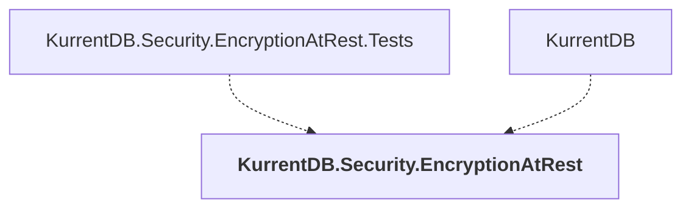

# KurrentDB.Security.EncryptionAtRest

## Overview

| Property | Value |
|----------|-------|
| Category | Application |
| Repository | src |
| Path | `KurrentDB.Security.EncryptionAtRest/KurrentDB.Security.EncryptionAtRest.csproj` |
| Project References | 0 |
| NuGet Dependencies | 2 |
| Consumers | 2 |

## Dependency Diagram

## Consumed By
- KurrentDB.Security.EncryptionAtRest.Tests
- KurrentDB

## External NuGet Packages
| Package | Version |
|---------|---------||
| Scrutor |  |
| Serilog |  |

---

*[Back to Index](../index.md)*
