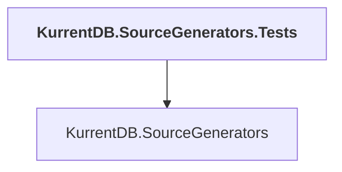

# KurrentDB.SourceGenerators.Tests

## Overview

| Property | Value |
|----------|-------|
| Category | Test |
| Repository | src |
| Path | `KurrentDB.SourceGenerators.Tests/KurrentDB.SourceGenerators.Tests.csproj` |
| Project References | 1 |
| NuGet Dependencies | 4 |
| Consumers | 0 |

## Dependency Diagram

## Project References
- KurrentDB.SourceGenerators

## External NuGet Packages
| Package | Version |
|---------|---------||
| Microsoft.CodeAnalysis.CSharp.SourceGenerators.Testing |  |
| Microsoft.CodeAnalysis.CSharp.Workspaces |  |
| Newtonsoft.Json |  |
| NuGet.Protocol |  |

---

*[Back to Index](../index.md)*
