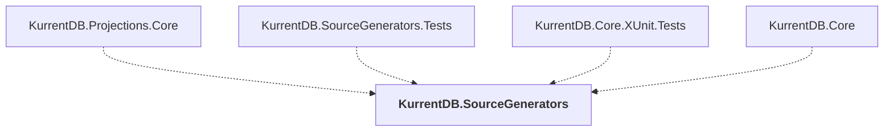

# KurrentDB.SourceGenerators

## Overview

| Property | Value |
|----------|-------|
| Category | Tool |
| Repository | src |
| Path | `KurrentDB.SourceGenerators/KurrentDB.SourceGenerators.csproj` |
| Project References | 0 |
| NuGet Dependencies | 2 |
| Consumers | 4 |

## Dependency Diagram

## Consumed By
- KurrentDB.Projections.Core
- KurrentDB.SourceGenerators.Tests
- KurrentDB.Core.XUnit.Tests
- KurrentDB.Core

## External NuGet Packages
| Package | Version |
|---------|---------||
| Microsoft.CodeAnalysis.Analyzers |  |
| Microsoft.CodeAnalysis.CSharp |  |

---

*[Back to Index](../index.md)*
