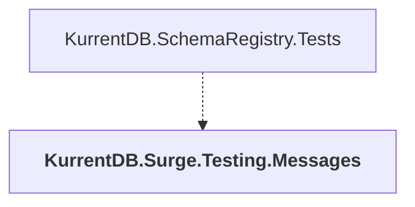

# KurrentDB.Surge.Testing.Messages

## Overview

| Property | Value |
|----------|-------|
| Category | Test |
| Repository | src |
| Path | `KurrentDB.Surge.Testing.Messages/KurrentDB.Surge.Testing.Messages.csproj` |
| Project References | 0 |
| NuGet Dependencies | 2 |
| Consumers | 1 |

## Dependency Diagram

## Consumed By
- KurrentDB.SchemaRegistry.Tests

## External NuGet Packages
| Package | Version |
|---------|---------||
| Google.Protobuf |  |
| Grpc.Tools |  |

---

*[Back to Index](../index.md)*
