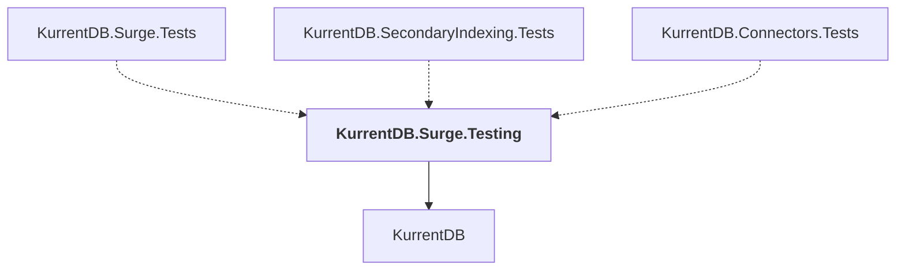

# KurrentDB.Surge.Testing

## Overview

| Property | Value |
|----------|-------|
| Category | Test |
| Repository | src |
| Path | `KurrentDB.Surge.Testing/KurrentDB.Surge.Testing.csproj` |
| Project References | 1 |
| NuGet Dependencies | 23 |
| Consumers | 3 |

## Dependency Diagram

## Project References
- KurrentDB

## Consumed By
- KurrentDB.Surge.Tests
- KurrentDB.SecondaryIndexing.Tests
- KurrentDB.Connectors.Tests

## External NuGet Packages
| Package | Version |
|---------|---------||
| Bogus |  |
| DotNext |  |
| FluentAssertions |  |
| Humanizer.Core |  |
| Eventuous.Testing |  |
| Kurrent.Surge |  |
| Microsoft.Extensions.TimeProvider.Testing |  |
| Microsoft.Extensions.Configuration.EnvironmentVariables |  |
| Microsoft.Extensions.Hosting.Abstractions |  |
| Microsoft.AspNetCore.TestHost |  |
| Serilog |  |
| Serilog.Enrichers.Thread |  |
| Serilog.Enrichers.Environment |  |
| Serilog.Enrichers.Process |  |
| Serilog.Exceptions |  |
| Serilog.Expressions |  |
| Serilog.Extensions.Logging |  |
| Serilog.Settings.Configuration |  |
| Serilog.Sinks.Console |  |
| Serilog.Sinks.Observable |  |
| Serilog.Sinks.Seq |  |
| Serilog.Sinks.File |  |
| System.Reactive |  |

---

*[Back to Index](../index.md)*
