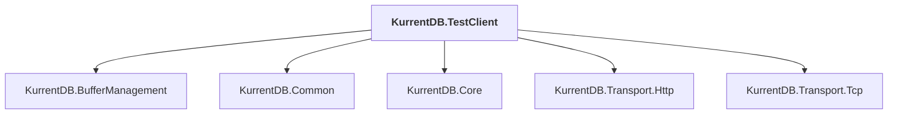

# KurrentDB.TestClient

## Overview

| Property | Value |
|----------|-------|
| Category | Test |
| Repository | src |
| Path | `KurrentDB.TestClient/KurrentDB.TestClient.csproj` |
| Project References | 5 |
| NuGet Dependencies | 6 |
| Consumers | 0 |

## Dependency Diagram

## Project References
- KurrentDB.BufferManagement
- KurrentDB.Common
- KurrentDB.Core
- KurrentDB.Transport.Http
- KurrentDB.Transport.Tcp

## External NuGet Packages
| Package | Version |
|---------|---------||
| EventStore.Client |  |
| EventStore.Client.Grpc.Streams |  |
| Google.Protobuf |  |
| Grpc.Net.Client |  |
| Grpc.Tools |  |
| System.CommandLine.DragonFruit |  |

---

*[Back to Index](../index.md)*
