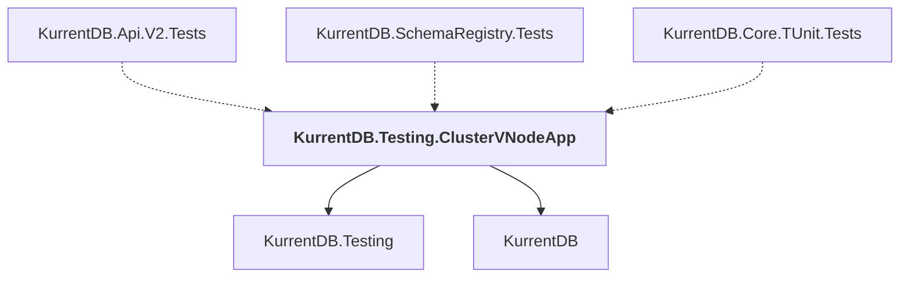

# KurrentDB.Testing.ClusterVNodeApp

## Overview

| Property | Value |
|----------|-------|
| Category | Test |
| Repository | src |
| Path | `KurrentDB.Testing.ClusterVNodeApp/KurrentDB.Testing.ClusterVNodeApp.csproj` |
| Project References | 2 |
| NuGet Dependencies | 5 |
| Consumers | 3 |

## Dependency Diagram

## Project References
- KurrentDB.Testing
- KurrentDB

## Consumed By
- KurrentDB.Api.V2.Tests
- KurrentDB.SchemaRegistry.Tests
- KurrentDB.Core.TUnit.Tests

## External NuGet Packages
| Package | Version |
|---------|---------||
| Grpc.Net.Client |  |
| OpenTelemetry.Exporter.OpenTelemetryProtocol |  |
| RestSharp |  |
| Testcontainers |  |
| Grpc.Tools |  |

---

*[Back to Index](../index.md)*
