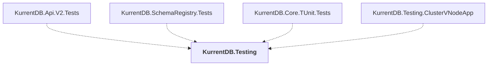

# KurrentDB.Testing

## Overview

| Property | Value |
|----------|-------|
| Category | Test |
| Repository | src |
| Path | `KurrentDB.Testing/KurrentDB.Testing.csproj` |
| Project References | 0 |
| NuGet Dependencies | 31 |
| Consumers | 4 |

## Dependency Diagram

## Consumed By
- KurrentDB.Api.V2.Tests
- KurrentDB.SchemaRegistry.Tests
- KurrentDB.Core.TUnit.Tests
- KurrentDB.Testing.ClusterVNodeApp

## External NuGet Packages
| Package | Version |
|---------|---------||
| Bogus |  |
| DiffEngine |  |
| DotNext |  |
| Humanizer.Core |  |
| Microsoft.Extensions.Configuration |  |
| Microsoft.Extensions.Configuration.EnvironmentVariables |  |
| Microsoft.Extensions.Configuration.Json |  |
| Microsoft.Extensions.DependencyInjection |  |
| Microsoft.Extensions.Logging |  |
| Microsoft.Extensions.TimeProvider.Testing |  |
| Serilog |  |
| Serilog.Enrichers.Demystifier |  |
| Serilog.Enrichers.Environment |  |
| Serilog.Enrichers.Process |  |
| Serilog.Enrichers.Thread |  |
| Serilog.Exceptions |  |
| Serilog.Expressions |  |
| Serilog.Extensions.Hosting |  |
| Serilog.Extensions.Logging |  |
| Serilog.Settings.Configuration |  |
| Serilog.Sinks.Console |  |
| Serilog.Sinks.Debug |  |
| Serilog.Sinks.Map |  |
| Serilog.Sinks.Observable |  |
| Serilog.Sinks.OpenTelemetry |  |
| Serilog.Sinks.Seq |  |
| Shouldly |  |
| System.Reactive |  |
| TUnit |  |
| WaffleGenerator.Bogus |  |
| Grpc.StatusProto |  |

---

*[Back to Index](../index.md)*
