# KurrentDB

## Overview

| Property | Value |
|----------|-------|
| Category | WebApp |
| Repository | src |
| Path | `KurrentDB/KurrentDB.csproj` |
| Project References | 21 |
| NuGet Dependencies | 10 |
| Consumers | 4 |

## Dependency Diagram

```mermaid
graph TD
    KurrentDB["<strong>KurrentDB</strong>"]
    KurrentDB_Auth_Ldaps["KurrentDB.Auth.Ldaps"]
    KurrentDB --> KurrentDB_Auth_Ldaps
    KurrentDB_Auth_LegacyAuthorizationWithStreamAuthorizationDisabled["KurrentDB.Auth.LegacyAuthorizationWithStreamAuthorizationDisabled"]
    KurrentDB --> KurrentDB_Auth_LegacyAuthorizationWithStreamAuthorizationDisabled
    KurrentDB_Auth_OAuth["KurrentDB.Auth.OAuth"]
    KurrentDB --> KurrentDB_Auth_OAuth
    KurrentDB_Auth_StreamPolicyPlugin["KurrentDB.Auth.StreamPolicyPlugin"]
    KurrentDB --> KurrentDB_Auth_StreamPolicyPlugin
    KurrentDB_Auth_UserCertificates["KurrentDB.Auth.UserCertificates"]
    KurrentDB --> KurrentDB_Auth_UserCertificates
    KurrentDB_ClusterNode_Web["KurrentDB.ClusterNode.Web"]
    KurrentDB --> KurrentDB_ClusterNode_Web
    KurrentDB_Common["KurrentDB.Common"]
    KurrentDB --> KurrentDB_Common
    KurrentDB_Core["KurrentDB.Core"]
    KurrentDB --> KurrentDB_Core
    KurrentDB_Diagnostics_LogsEndpointPlugin["KurrentDB.Diagnostics.LogsEndpointPlugin"]
    KurrentDB --> KurrentDB_Diagnostics_LogsEndpointPlugin
    KurrentDB_OtlpExporterPlugin["KurrentDB.OtlpExporterPlugin"]
    KurrentDB --> KurrentDB_OtlpExporterPlugin
    KurrentDB_PluginHosting["KurrentDB.PluginHosting"]
    KurrentDB --> KurrentDB_PluginHosting
    KurrentDB_POC_ConnectedSubsystemsPlugin["KurrentDB.POC.ConnectedSubsystemsPlugin"]
    KurrentDB --> KurrentDB_POC_ConnectedSubsystemsPlugin
    KurrentDB_Projections_Core["KurrentDB.Projections.Core"]
    KurrentDB --> KurrentDB_Projections_Core
    KurrentDB_Security_EncryptionAtRest["KurrentDB.Security.EncryptionAtRest"]
    KurrentDB --> KurrentDB_Security_EncryptionAtRest
    KurrentDB_AutoScavenge["KurrentDB.AutoScavenge"]
    KurrentDB --> KurrentDB_AutoScavenge
    KurrentDB_TcpPlugin["KurrentDB.TcpPlugin"]
    KurrentDB --> KurrentDB_TcpPlugin
    KurrentDB_SecondaryIndexing["KurrentDB.SecondaryIndexing"]
    KurrentDB --> KurrentDB_SecondaryIndexing
    KurrentDB_UI["KurrentDB.UI"]
    KurrentDB --> KurrentDB_UI
    KurrentDB_Plugins_Connectors["KurrentDB.Plugins.Connectors"]
    KurrentDB --> KurrentDB_Plugins_Connectors
    KurrentDB_Plugins_SchemaRegistry["KurrentDB.Plugins.SchemaRegistry"]
    KurrentDB --> KurrentDB_Plugins_SchemaRegistry
    KurrentDB_Plugins_Api_V2["KurrentDB.Plugins.Api.V2"]
    KurrentDB --> KurrentDB_Plugins_Api_V2
    KurrentDB_Surge_Testing["KurrentDB.Surge.Testing"]
    KurrentDB_Surge_Testing -.-> KurrentDB
    KurrentDB_SchemaRegistry_Tests["KurrentDB.SchemaRegistry.Tests"]
    KurrentDB_SchemaRegistry_Tests -.-> KurrentDB
    KurrentDB_Testing_ClusterVNodeApp["KurrentDB.Testing.ClusterVNodeApp"]
    KurrentDB_Testing_ClusterVNodeApp -.-> KurrentDB
    KurrentDB_Connectors_Tests["KurrentDB.Connectors.Tests"]
    KurrentDB_Connectors_Tests -.-> KurrentDB
```

## Project References
- KurrentDB.Auth.Ldaps
- KurrentDB.Auth.LegacyAuthorizationWithStreamAuthorizationDisabled
- KurrentDB.Auth.OAuth
- KurrentDB.Auth.StreamPolicyPlugin
- KurrentDB.Auth.UserCertificates
- KurrentDB.ClusterNode.Web
- KurrentDB.Common
- KurrentDB.Core
- KurrentDB.Diagnostics.LogsEndpointPlugin
- KurrentDB.OtlpExporterPlugin
- KurrentDB.PluginHosting
- KurrentDB.POC.ConnectedSubsystemsPlugin
- KurrentDB.Projections.Core
- KurrentDB.Security.EncryptionAtRest
- KurrentDB.AutoScavenge
- KurrentDB.TcpPlugin
- KurrentDB.SecondaryIndexing
- KurrentDB.UI
- KurrentDB.Plugins.Connectors
- KurrentDB.Plugins.SchemaRegistry
- KurrentDB.Plugins.Api.V2

## Consumed By
- KurrentDB.Surge.Testing
- KurrentDB.SchemaRegistry.Tests
- KurrentDB.Testing.ClusterVNodeApp
- KurrentDB.Connectors.Tests

## External NuGet Packages
| Package | Version |
|---------|---------||
| BlazorMonaco |  |
| Extensions.MudBlazor.StaticInput |  |
| Microsoft.AspNetCore.Components.WebAssembly.Server |  |
| Microsoft.Extensions.Hosting.WindowsServices |  |
| Microsoft.IdentityModel.Tokens |  |
| MudBlazor.Markdown |  |
| MudBlazor |  |
| SharpDotYaml.Extensions.Configuration |  |
| System.ComponentModel.Composition |  |
| System.IdentityModel.Tokens.Jwt |  |

---

*[Back to Index](../index.md)*
