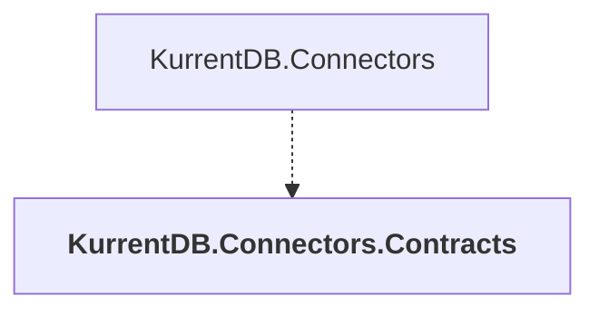

# KurrentDB.Connectors.Contracts

## Overview

| Property | Value |
|----------|-------|
| Category | Connector |
| Repository | src |
| Path | `Connectors/KurrentDB.Connectors.Contracts/KurrentDB.Connectors.Contracts.csproj` |
| Project References | 0 |
| NuGet Dependencies | 3 |
| Consumers | 1 |

## Dependency Diagram

## Consumed By
- KurrentDB.Connectors

## External NuGet Packages
| Package | Version |
|---------|---------||
| Google.Api.CommonProtos |  |
| Google.Protobuf |  |
| Grpc.AspNetCore |  |

---

*[Back to Index](../index.md)*
